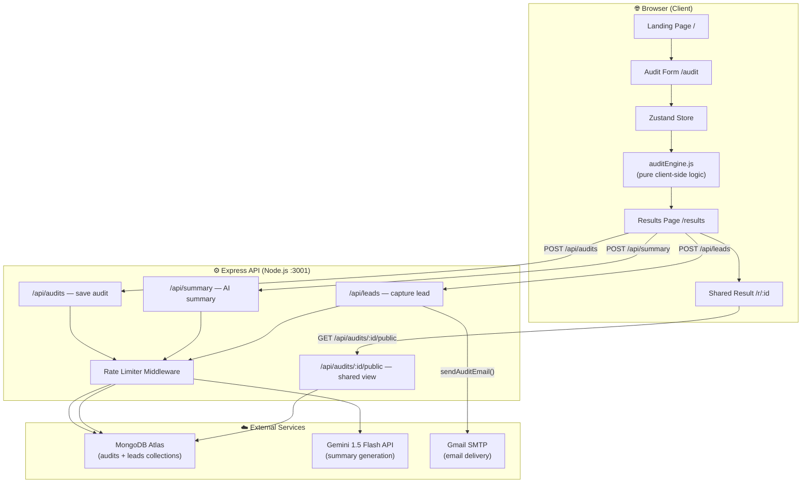

# Architecture — SpendScan AI

---

## System Overview

SpendScan AI is a full-stack monorepo with a React SPA frontend and a Node.js/Express backend. The core audit logic runs **entirely client-side** — no server round-trip needed for recommendations. The backend only handles persistence, AI summaries, and lead capture.

---

## System Diagram



---

## Request / Data Flow

```
① User fills audit form
   └─ Zustand store accumulates: [{ toolId, planId, seats, monthlySpend, useCase }]

② User clicks "Run My Audit"
   └─ runAudit() executes in-browser (zero network latency)
   └─ Returns: { toolResults[], redundancyWarnings[], totalMonthlySavings, verdict, ... }

③ Result is persisted
   └─ POST /api/audits → MongoDB saves { auditId, entries, result }
   └─ auditId returned → stored in Zustand

④ Results page loads
   └─ POST /api/summary → Gemini generates 100-word paragraph
   └─ Fallback: template summary if Gemini is down/rate-limited

⑤ User submits email (optional)
   └─ POST /api/leads → saved to leads collection
   └─ sendAuditEmail() → Gmail SMTP sends branded HTML report

⑥ Shared link flow
   └─ /r/:auditId → GET /api/audits/:id/public
   └─ Returns anonymized data (no email, no company name)
```

---

## Tech Stack Rationale

| Layer | Choice | Why |
|---|---|---|
| **Frontend** | React 18 + Vite | Fast HMR, no SSR complexity needed for a form+results SPA. Vite build is 3–5× faster than CRA. |
| **State** | Zustand | Minimal API, built-in `persist` middleware for localStorage. Redux is overkill for 4 state fields. |
| **Routing** | React Router v6 | Standard SPA routing; `useNavigate` + `useParams` cover all routes. |
| **HTTP Client** | Axios | Consistent error shape, better than raw `fetch` for interceptors and timeout handling. |
| **Backend** | Express.js | Lightweight, no cold-start issues on Render free tier. Familiar ecosystem. |
| **Database** | MongoDB Atlas + Mongoose | Schema-flexible (audit results vary in shape), M0 free tier, Mongoose adds validation layer. |
| **AI** | Gemini 1.5 Flash | Fast (~1s), cheap ($0.075/1M input tokens), adequate quality for short summaries. Free tier generous. |
| **Email** | Nodemailer + Gmail SMTP | No domain verification requirement, no paid plan needed at early scale. |
| **Deployment** | Vercel (FE) + Render (BE) | Both have free tiers. Vercel edge handles CDN + SPA routing automatically. |

---

## Key Architectural Decisions

### 1. Audit Engine is 100% Client-Side
`auditEngine.js` runs in the browser with no API call. This means:
- **Zero compute cost** per audit (scales infinitely)
- **Instant results** — no loading spinner for the core analysis
- **Works offline** after initial page load

Trade-off: Pricing data is bundled in the JS file — must redeploy to update prices.

### 2. Shared Links Are Anonymized at the API Layer
`GET /api/audits/:id/public` strips all PII before returning data. Even if a MongoDB record contains `leadEmail`, the public endpoint never exposes it. Anonymization happens server-side, not client-side.

### 3. Gemini Summary is a Progressive Enhancement
The results page renders immediately from local state. The AI summary loads asynchronously and has a template fallback:
```
if (Gemini fails) → use deterministic template based on audit data
```
Users always see a complete page, never a broken experience.

### 4. Rate Limiting at Middleware Level
Three separate rate limiters:
- `apiLimiter` — 100 req/15min per IP (general endpoints)
- `leadLimiter` — 5 req/hour per IP (lead capture, prevents spam)
- `summaryLimiter` — 20 req/hour per IP (Gemini calls, cost protection)

---

## File Structure

```
spendscan/
├── client/                    # React + Vite SPA
│   └── src/
│       ├── components/        # Reusable UI components
│       │   ├── AISummary.jsx
│       │   ├── CredexCTA.jsx
│       │   ├── EmailCaptureForm.jsx
│       │   ├── RedundancyWarnings.jsx
│       │   ├── SavingsBanner.jsx
│       │   └── ToolEntry.jsx / ToolResult.jsx
│       ├── pages/             # Route-level page components
│       │   ├── LandingPage.jsx
│       │   ├── AuditPage.jsx
│       │   ├── ResultsPage.jsx
│       │   └── SharedResultPage.jsx
│       ├── store/
│       │   └── auditStore.js  # Zustand global state
│       └── utils/
│           └── auditEngine.js # Core recommendation logic (client-side)
│
└── server/                    # Express API
    └── src/
        ├── models/
        │   ├── Audit.js       # MongoDB schema for audit results
        │   └── Lead.js        # MongoDB schema for email leads
        ├── routes/
        │   ├── audits.js      # POST /api/audits, GET /api/audits/:id/public
        │   ├── leads.js       # POST /api/leads
        │   └── summary.js     # POST /api/summary (Gemini)
        ├── middleware/
        │   └── rateLimiter.js
        ├── services/
        │   └── emailService.js # Nodemailer HTML email
        ├── db.js              # MongoDB connection
        └── server.js          # App entry point
```

---

## Scaling Plan (10k Audits/Day)

| Bottleneck | Current | Fix at Scale |
|---|---|---|
| Audit computation | Client-side, free | Already scales infinitely — no change needed |
| MongoDB reads (shared links) | Direct DB query | Add Redis cache with 24h TTL, keyed by `auditId` |
| Gemini API calls | Per-request | Queue + batch; cache by tool combination hash |
| Email delivery | Gmail SMTP (500/day limit) | Migrate to Resend or SES; add BullMQ queue |
| Backend CPU | Render free tier (0.5 vCPU) | Upgrade to Render Starter ($7/mo) or migrate to Railway |
| MongoDB storage | M0 free (512MB) | Upgrade to M10 Atlas with auto-scaling enabled |
| Frontend | Vercel free tier | Already edge-deployed globally — no change needed |
