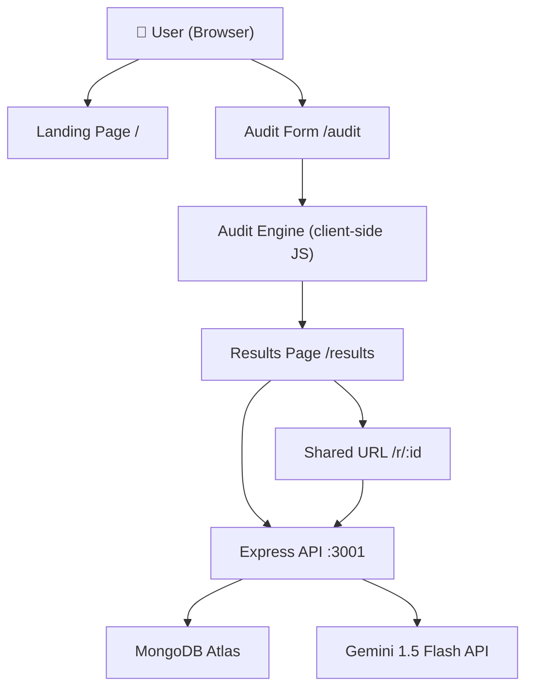

# Architecture — SpendScan AI

## System Diagram

## Data Flow

1. **User fills form** → Zustand store holds entries (toolId, planId, seats, monthlySpend, useCase)
2. **Submit** → `runAudit()` runs entirely in the browser — no network call for the core logic
3. **Audit result** → POST to `/api/audits` to save in MongoDB, receive `auditId`
4. **Results page** → POST to `/api/summary` for Gemini-generated paragraph (fallback to template if API fails)
5. **Lead capture** → POST to `/api/leads` with email + optional fields
6. **Shared URL** → GET `/api/audits/:id/public` returns anonymized result (no email, no company name)

## Why This Stack

**React + Vite** — Fast iteration, no SSR complexity needed for a form + results SPA. Vite's HMR is significantly faster than CRA.

**Zustand** — Minimal state management with built-in persistence middleware. Redux is overkill for this scope.

**Express** — Lightweight, well-understood, easy to deploy on Render free tier. No serverless cold-start issues for a demo.

**MongoDB Atlas** — Schema-flexible (audit results vary in shape), free tier, easy cloud setup. Mongoose adds validation.

**Gemini 1.5 Flash** — Fast, cheap (~$0.075/1M tokens input), sufficient quality for 100-word paragraphs. Generous free tier.

## Scaling to 10k Audits/Day

1. **Audit engine stays client-side** — No compute cost per audit. Already scales infinitely.
2. **Add Redis caching** — Cache public audit results by `auditId` with 24h TTL to reduce MongoDB reads.
3. **MongoDB Atlas autoscaling** — Upgrade to M10+ with connection pooling; add indexes on `auditId`, `createdAt`.
4. **API rate limiting** — Already implemented with express-rate-limit; tighten per-IP limits.
5. **Gemini batching** — Queue summary requests, process in batches during off-peak; serve cached summaries for repeated tool combinations.
6. **CDN for frontend** — Already handled by Vercel's edge network.
7. **Email queue** — Move transactional emails to a queue (BullMQ + Redis) to handle spikes without blocking API responses.
